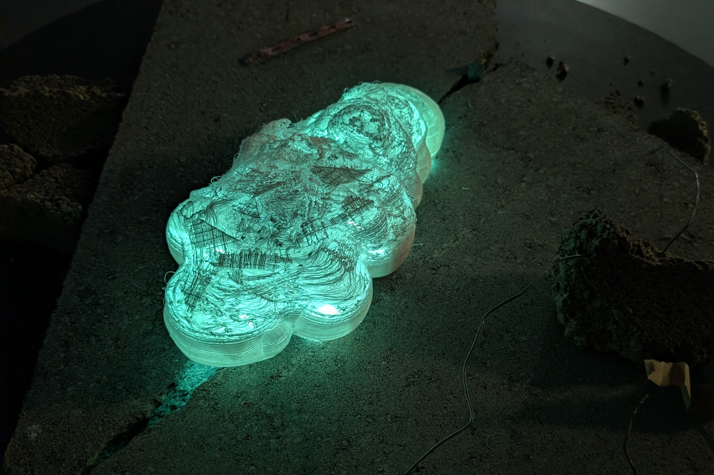

# Pulmo

**Pulmo** is a speculative robot inspired by sea slugs and bioluminescent marine life. It performs slow, breathing-like movements. As air pollution increases, Pulmo’s breathing becomes rapid. Its skin shifts to red as a warning signal. In clean air, its breathing is slow and its body emits a blue-green glow. Pulmo makes air pollution visible and emotionally perceptible.

Pulmo is part of a fictional group of robots created by the last humans before all living beings on Earth had disappeared. These robots were meant to care for the planet, based on the belief that technology could fix the damage humans had caused. Long after humans are gone, the robots continue their work alone making them useless creatures.

## Components

This project is a mix of Arduino & 3D printing. It uses one servo-motor, a CO2 sensor MQ-135 and LEDs ([see details](code)).

# What’s in this repo

- [process/journal.md](process/journal.md) — Development journal
- [process/](process) — Project process
- [code/](code) — Arduino code & schematics
- [presskit/](presskit) — Abstract and medias about the project

> *Most of our process is written in french.*

## Team
Vincent Paley [@noctoplasma](https://instagram.com/noctoplasma) & Antony Neyret [antony.cool](https://antony.cool/)

# About the workshop — Soft Robotics

Project made during the Soft Robotics workshop in Master Media Design, HEAD – Genève.

- **Partners: CNRS, CEA, INRIA**
- **Professors: Clara Rigaud, Benjamin Gaulon**

As our planet faces accelerating ecological crises, robotics offers new ways of perceiving, sensing, and interacting with the environment. Moving beyond efficiency and automation, this workshop explores soft, ecological, and sensitive robots.