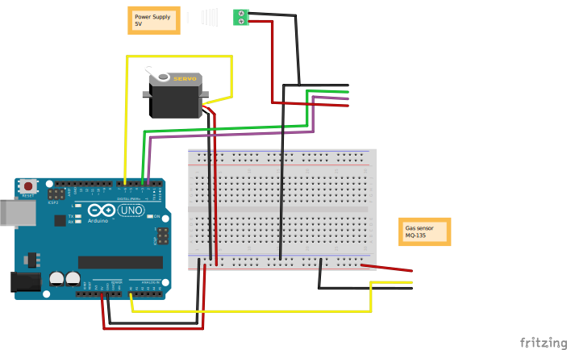

# Components

- Arduino Uno R3
- MQ-135
- LED 20mm [Adafruit](https://www.adafruit.com/product/1547) [docs](https://learn.adafruit.com/20mm-led-pixels?embeds=allow)
- Basic servo-motor

# Wiring
[fritzing schematic file](schematic.fzz)