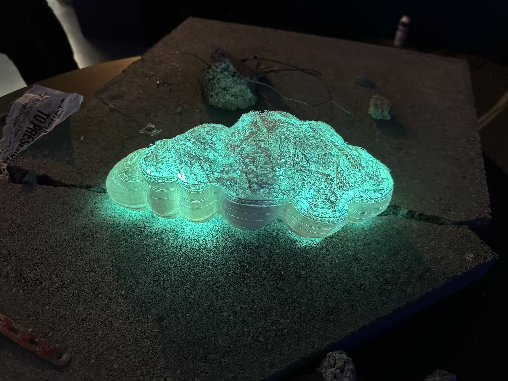
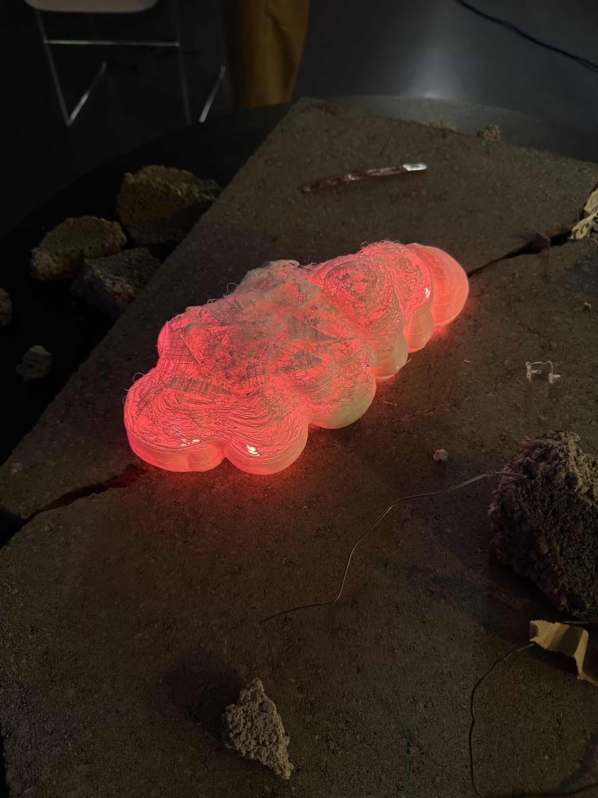
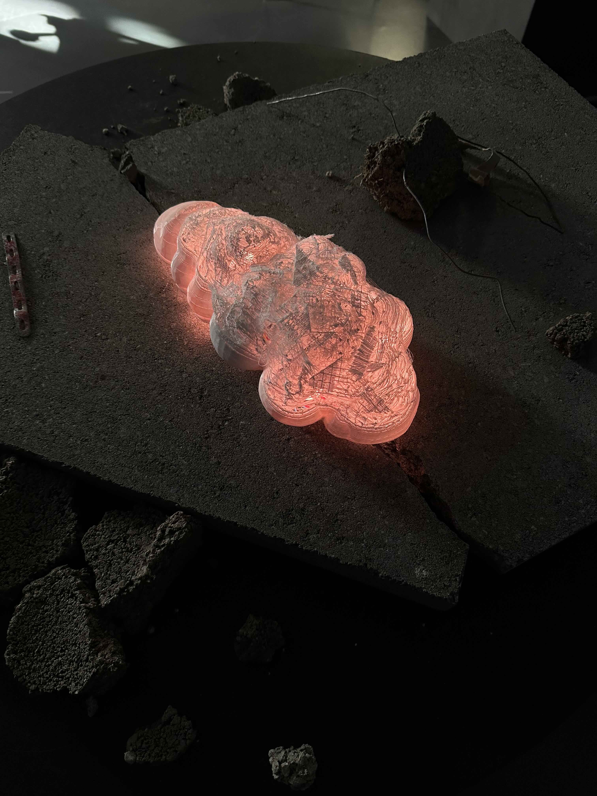

# Pulmo

**Pulmo** is a speculative robot inspired by sea slugs and bioluminescent marine life. It performs slow, breathing-like movements. As air pollution increases, Pulmo’s breathing becomes rapid. Its skin shifts to red as a warning signal. In clean air, its breathing is slow and its body emits a blue-green glow. Pulmo makes air pollution visible and emotionally perceptible. From within its body also escapes a high-pitched, wheezing, almost scream-like noise. As pollution levels rise, this sound intensifies, giving Pulmo a fragile, anxious personality.

Pulmo is part of a fictional group of robots created by the last humans before all living beings on Earth had disappeared. These robots were meant to care for the planet, based on the belief that technology could fix the damage humans had caused. Long after humans are gone, the robots continue their work alone making them useless creatures.

# Scenography

|  |  |
| --------------------------- | -------------------------- |

# References

Pulmo is inspired by marine organisms reacting to toxic environments and bioluminescent warning systems.

- **Tobias Bradford – dying mechanical dog**  
- **marine organisms (sea-slugs, jellyfish) when on land**  
- **Bioluminescent sea animals** : Light as a stress signal or defense mechanism
- **Ômu – _Nausicaä of the Valley of the Wind_**  

# Medias

[Link to medias folder](medias) — [Presentation](keynote.pdf)

|  |  |
| ------------------------- | ---------------------------- |

# Team
Vincent Paley [@noctoplasma](https://instagram.com/noctoplasma) & Antony Neyret [https://antony.cool](https://antony.cool/)