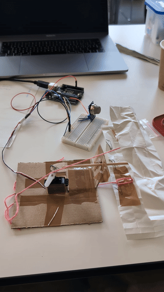
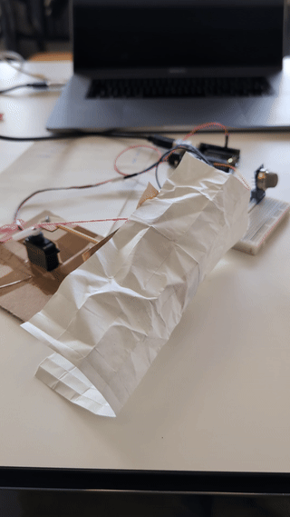
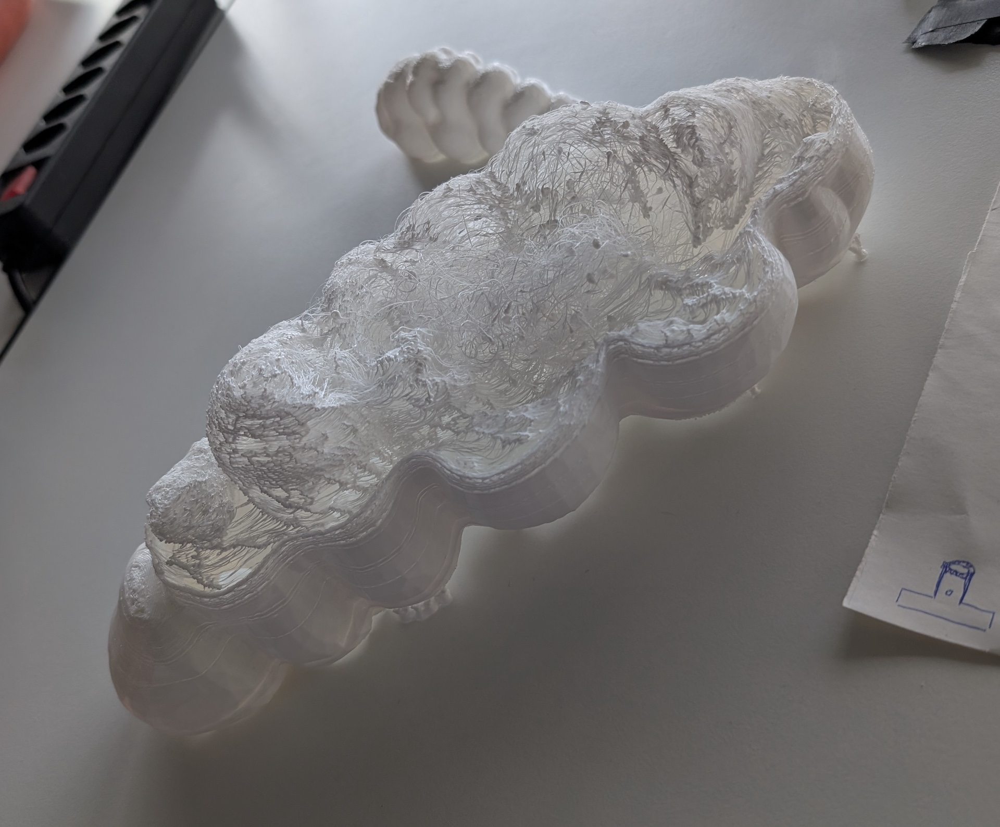
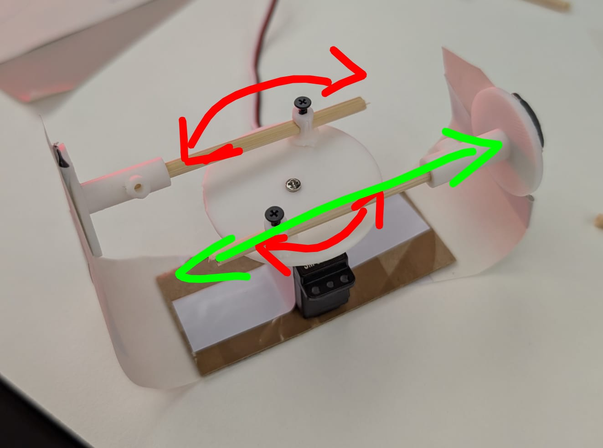

## 2026-01-06

Avec Vincent, on a réfléchit à quelques idées. inspirés de différents objets et animaux marins. À savoir le télégraphe optique pour l'aspect relais de communication via des symboles, les méduses et leurs aspect flottant, les hippocampes ou encore les *Ômu* dans *Nausicaa de la vallée du vent* avec leurs yeux de couleurs rouges et bleus.

Cela donnerait une méduse volante dans les milieux urbains qui régule la répartition de l'eau vers les zones arides. En captant l'humidité de l'air et l'eau de pluie, le robot pourrait redistribuer dans les cultures par exemples. De plus, il s'agirait d'un réseau de plusieurs méduses qui flotteraient et communiqueraient entre elles via des signaux lumineux (télégraphe). Chacune serait un agent autonome dans le réseau.

**Quelques interrogations**: 
pourquoi remplacer la nature? quels sont les risques parado sur l'enviro ?
Comment ça vole ou ça se déplace ?
Comment c'est alimenté ?

## 2026-01-07

Brocante.
Field research et démontage de matériel tech.
Démontage d'un caméscope.

## 2026-01-08

On a encore exploré quelques idées différentes car nous ne sommes pas satisfaits de l'idée de faire voler ou de la méduse. Nous sommes partis sur faire un réseau hors internet, puis d'une carte des déchets qui volent dans la rue. (Voir [2026-01-08_research](2026-01-08_research.md).)

Nous avons fait quelques tests de [code](../code/2026-01-08_morse-code) communication via lumière en envoyant du morse. Peut-être que le binaire serait plus pertinent ? On a aussi tester de faire gonfler du papier ou du tissu avec un ventilateur d'un vieux beamer. Finalement, une autre idée est venue: 

**Badly surviving robot.**
Breathing robot based on air pollution levels (CO2 sensor). The robot struggles to breath. Inspired by bioluminescent sea animals, it flashes when someone is too close to protect itself. It's not really friendly. It is also inspired by the fish that grows when in danger. We are thinking about some mouvement behaviour like it has one leg to move but it's useless or like an accordéon or a worm. But since it's disoriented due to air pollution it's in agony struggling to survive. We will try to make it a bit cute to play with empathy.

#### **Feedback IA Euria:**

- Clarifier le concept : Choisir une seule métaphore forte (ex. : un poisson asphyxié par la pollution, ou un méduse qui clignote quand l’air est toxique).
- Simplifier le mouvement : Utiliser un seul type de mouvement expressif (ex. : pulsation, respiration) plutôt qu’un “accordéon inutile”.
- Renforcer le lien écologique : Lier la pollution de l’air à un impact sur les écosystèmes marins (ex. : acidification des océans due au CO₂).
- Jouer sur l’empathie : Rendre le robot plus “vivant” (ex. : battements de cœur, sons respiratoires) pour créer un lien émotionnel.

## 2026-01-09 — Mid-presentation

Nous avons travaillé sur le dernier concept en date: Le robot qui agonit. Clara nous a montré [une oeuvre](https://www.instagram.com/tobias_bradford/reel/DAOQzbexlxh/) de Tobias Bradford d'un chien mécanique qui meurt et respire mal avec un accordéon.

Pour présenter le concept l'après-midi, nous avons fait une [affiche](poster/spicies-poster.pdf). Vincent a réussi à allumer ses LEDs. Antony a fait un petit [prototype](attachments/2026-01-09-prototype1.jpg) qui à partir d'un composant MQ-2 (capteur de fumée), fait bouger une servo-moteur ([code](code/2026-01-09_breathing-air-servo)).

Nous avons eu quelques feedback notamment sur les matériaux, peut-être imprimer 3D TPU.

## 2026-01-12

On a tester plusieurs prototypes de mécanismes. Antony a réalisé un test de mécanisme en 3D sur [fusion](attachments/2026-01-12-fusion.jpg). Vincent a pu faire des tests d'impression sur le TPU. Ça devrait être assez flexible pour le faire bouger. Et [laisse bien passer la lumière](attachments/2026-01-12-proto-lights-trought.jpg). On tente une impression plus grande. Idéalement, j'aurais apprécié utiliser des matériaux recyclés. Ou le minimal d'impression 3D.

Un discussion avec Pablo a aidé de réfléchir à un [mécanisme](attachments/2026-01-12-sketches-mechanism.jpg) plus simple. A tester demain.

|  |  |
| ---------------------- | ---------------------- |

## 2026-01-13

La 3D TPU n'a pas bien fonctionné mais donne un aspect organique que nous allons garder. Ca rend aussi la bête plus vulnérable.

Nous avons testé le mécanisme décrit hier. Bien-sûr c'est seulement en fin de journée qu'on a réussi à le faire fonctionner. Le soucis: Le mouvement du servo-moteur doit rester sur un axe droit donc ne pas trop tourner. Sans faire de calculs un mouvement de 70° pour un diamètre de 40mm avec le centre du trou rotation à 4mm du bord du cercle fonctionne bien. De plus, les poussoirs doivent être rattachés au servo-moteur. Des bandes de papier fonctionnent bien.

|  |  |
| ------------------------------ | ---------------------- |
Pour l'impression 3D, [slicer](attachments/2026-01-13-slicer.jpg) le cercle en vertical.

**Scénario**

Nous avons repensé le scénario. Soit, Il s'agit d'une métaphore. Permet de voir l'invisible. La pollution de l'air n'est pas visible, elle se ressent. Ce robot est passif. Il permet de matérialiser la pollution de l'air. Soit, il s'agit d'un scénario de film de science-fiction.

*Humanity destroyed all living beings on Earth. Before its own extinction, it formed groups of scientists to create a new, self-sustaining ecosystem of robots. Driven by the will to leave a lasting mark on the planet, humans convinced themselves that nature needed their intervention even as they were the cause of its collapse. Robots continues their tasks alone. Humanity’s mark remains even though it is long gone.*

## 2026-01-14

Vincent added some fish-bones like inside the shell to give it more volume and also fix the 3D problem in our favor. We changed the servo to a more powerful one. We had to adapt the 3D printed [circle fixation on the servo](attachments/2026-01-14-mecanism.jpg). It was to fitting anymore. We got new toys from Andrea and a MQ-135 for air quality detection. So now we use it!

The [code](../code/2026-01-14-breathing-light) is now handling the breathing and the color-shiffting from blue-green to red when CO2 or gaz is detected. range from <80 = good, >350 = bad air quality. For testing we use a lighter, butane triggers the system.

Tomorrow we create the scenography and done! :) It lives in urban environment, it's a dangerous place anything can hurt it. But the worse is the air pollution. We still have to find a name. something probably with the fact that is sensing air or alone.

Breathing air pollution (alone).

## 2026-01-15

Préparation de la présentation, mise en place de la scénographie. Réalisation d'une fausse en-tête de journal pour la contextualisation. Aller près des chantier pour récupérer des morceaux de béton et de barres en métal. Did [3D scans](./3D-scans/) of the scenography.

